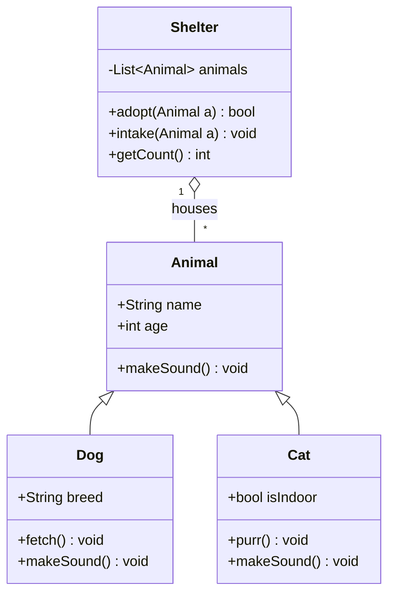
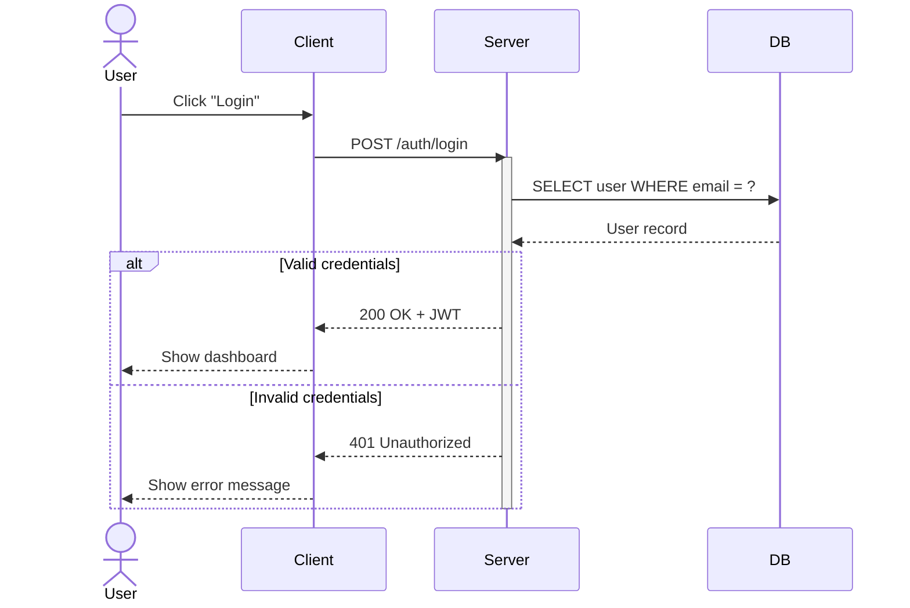
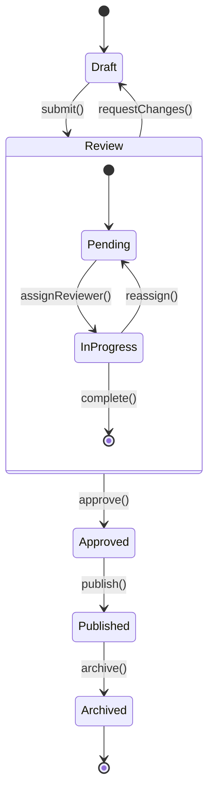
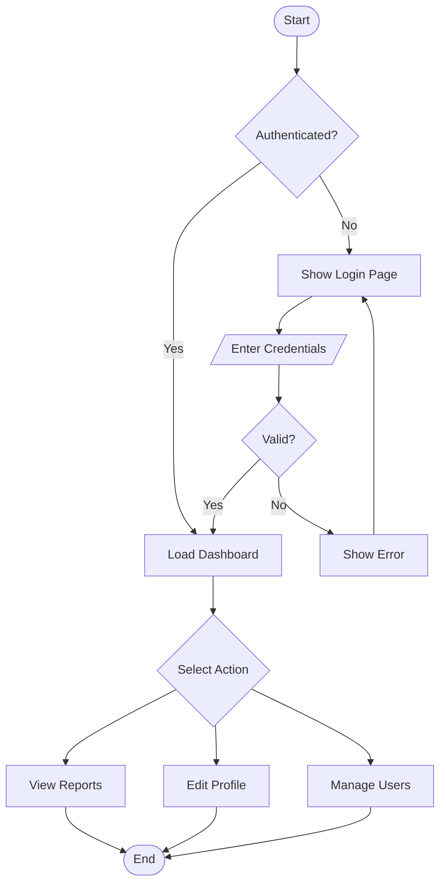
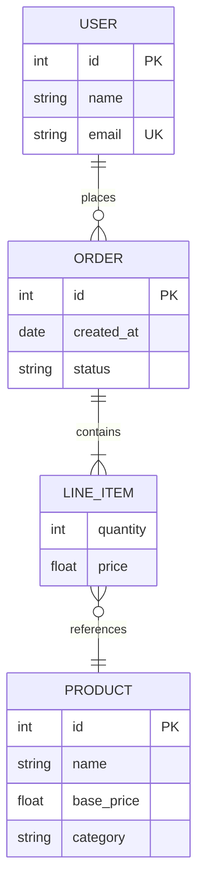

# Mermaid UML Diagrams

Mermaid supports several UML diagram types directly in markdown.

## Class Diagram

## Sequence Diagram

## State Diagram

## Activity Diagram (Flowchart)

## ER Diagram

