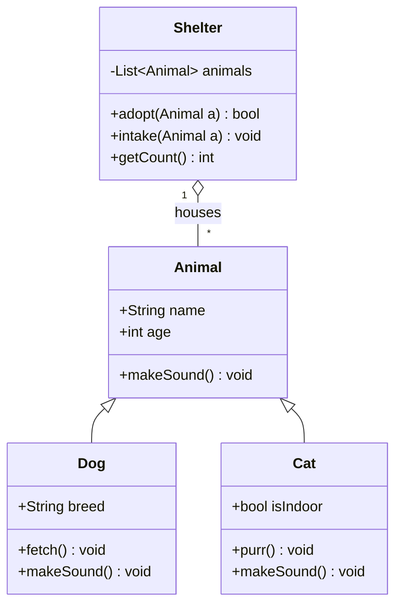
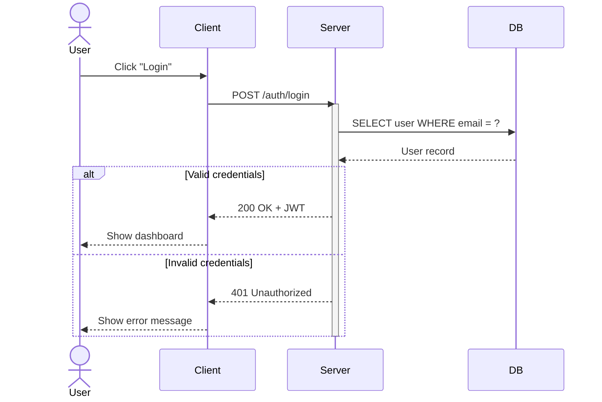
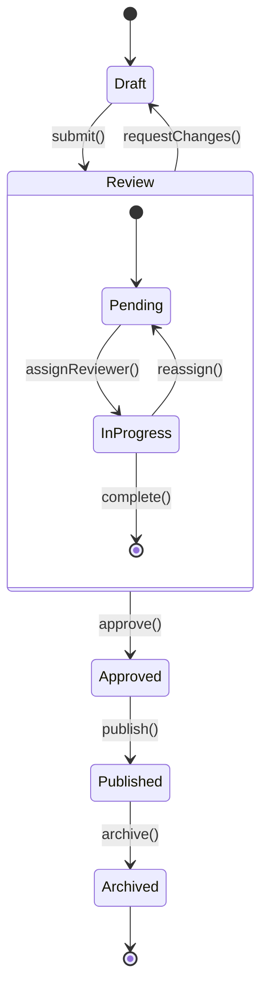
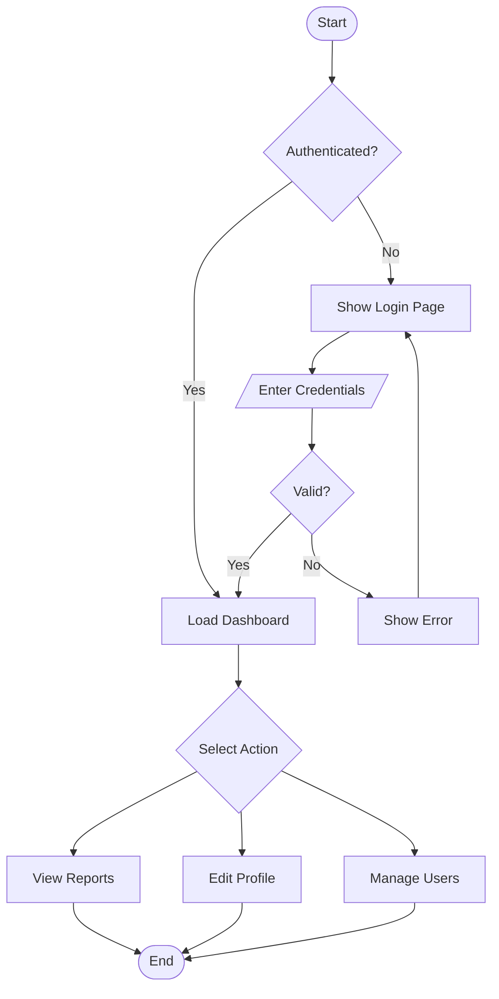
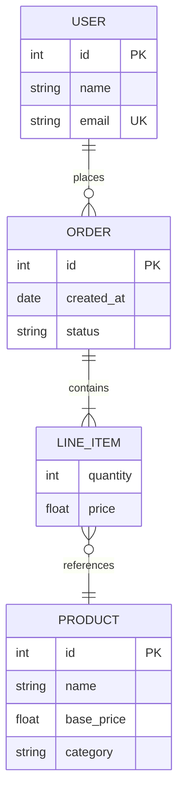

# Mixed Content Showcase

This document demonstrates various markdown features, LaTeX expressions, and code snippets all in one place.

## Mathematical Expressions

### Calculus and Analysis
The derivative of $f(x) = x^n$ is: $f'(x) = nx^{n-1}$

The definite integral: $\int_a^b f(x) dx = F(b) - F(a)$ where $F'(x) = f(x)$

**Taylor Series Expansion:**
$$e^x = \sum_{n=0}^{\infty} \frac{x^n}{n!} = 1 + x + \frac{x^2}{2!} + \frac{x^3}{3!} + \cdots$$

### Linear Algebra
Matrix multiplication: $(AB)_{ij} = \sum_{k=1}^{n} a_{ik}b_{kj}$

Eigenvalue equation: $Av = \lambda v$ where $\lambda$ is the eigenvalue

**Rotation Matrix (2D):**
$$R(\theta) = \begin{pmatrix} \cos\theta & -\sin\theta \\ \sin\theta & \cos\theta \end{pmatrix}$$

## Code Examples

### Python Data Analysis
```python
import numpy as np
import pandas as pd
import matplotlib.pyplot as plt
from sklearn.linear_model import LinearRegression

# Generate sample data
np.random.seed(42)
n_samples = 100
X = np.random.randn(n_samples, 1)
y = 3 * X.squeeze() + 2 + 0.1 * np.random.randn(n_samples)

# Fit linear regression
model = LinearRegression()
model.fit(X, y)

# Predictions
y_pred = model.predict(X)

print(f"Coefficient: {model.coef_[0]:.3f}")
print(f"Intercept: {model.intercept_:.3f}")
print(f"R² Score: {model.score(X, y):.3f}")

# Visualization
plt.figure(figsize=(10, 6))
plt.scatter(X, y, alpha=0.7, label='Data')
plt.plot(X, y_pred, 'r-', linewidth=2, label='Fitted line')
plt.xlabel('X')
plt.ylabel('y')
plt.title('Linear Regression Example')
plt.legend()
plt.grid(True, alpha=0.3)
plt.show()
```

### JavaScript Web Development
```javascript
// Modern async/await with error handling
class APIClient {
    constructor(baseURL) {
        this.baseURL = baseURL;
        this.headers = {
            'Content-Type': 'application/json'
        };
    }

    async get(endpoint) {
        try {
            const response = await fetch(`${this.baseURL}${endpoint}`, {
                method: 'GET',
                headers: this.headers
            });

            if (!response.ok) {
                throw new Error(`HTTP error! status: ${response.status}`);
            }

            return await response.json();
        } catch (error) {
            console.error('API GET request failed:', error);
            throw error;
        }
    }

    async post(endpoint, data) {
        try {
            const response = await fetch(`${this.baseURL}${endpoint}`, {
                method: 'POST',
                headers: this.headers,
                body: JSON.stringify(data)
            });

            if (!response.ok) {
                throw new Error(`HTTP error! status: ${response.status}`);
            }

            return await response.json();
        } catch (error) {
            console.error('API POST request failed:', error);
            throw error;
        }
    }
}

// Usage example
const api = new APIClient('https://jsonplaceholder.typicode.com');

// Using the API client
async function fetchUserData(userId) {
    try {
        const user = await api.get(`/users/${userId}`);
        const posts = await api.get(`/users/${userId}/posts`);
        
        return {
            user,
            posts,
            totalPosts: posts.length
        };
    } catch (error) {
        console.error('Failed to fetch user data:', error);
        return null;
    }
}
```

### Rust Systems Programming
```rust
use std::collections::HashMap;
use std::thread;
use std::sync::{Arc, Mutex};
use std::time::{Duration, Instant};

#[derive(Debug, Clone)]
pub struct CacheEntry<T> {
    value: T,
    created_at: Instant,
    access_count: usize,
}

pub struct ThreadSafeCache<K, V> 
where
    K: Clone + Eq + std::hash::Hash + Send + Sync,
    V: Clone + Send + Sync,
{
    data: Arc<Mutex<HashMap<K, CacheEntry<V>>>>,
    max_size: usize,
    ttl: Option<Duration>,
}

impl<K, V> ThreadSafeCache<K, V>
where
    K: Clone + Eq + std::hash::Hash + Send + Sync + 'static,
    V: Clone + Send + Sync + 'static,
{
    pub fn new(max_size: usize, ttl: Option<Duration>) -> Self {
        Self {
            data: Arc::new(Mutex::new(HashMap::new())),
            max_size,
            ttl,
        }
    }

    pub fn get(&self, key: &K) -> Option<V> {
        let mut cache = self.data.lock().unwrap();
        
        if let Some(entry) = cache.get_mut(key) {
            // Check TTL
            if let Some(ttl) = self.ttl {
                if entry.created_at.elapsed() > ttl {
                    cache.remove(key);
                    return None;
                }
            }
            
            entry.access_count += 1;
            Some(entry.value.clone())
        } else {
            None
        }
    }

    pub fn insert(&self, key: K, value: V) {
        let mut cache = self.data.lock().unwrap();
        
        // Remove expired entries
        if let Some(ttl) = self.ttl {
            cache.retain(|_, entry| entry.created_at.elapsed() <= ttl);
        }
        
        // Evict if at capacity (LRU)
        if cache.len() >= self.max_size && !cache.contains_key(&key) {
            if let Some(lru_key) = cache
                .iter()
                .min_by_key(|(_, entry)| entry.access_count)
                .map(|(k, _)| k.clone())
            {
                cache.remove(&lru_key);
            }
        }
        
        let entry = CacheEntry {
            value,
            created_at: Instant::now(),
            access_count: 0,
        };
        
        cache.insert(key, entry);
    }

    pub fn size(&self) -> usize {
        self.data.lock().unwrap().len()
    }
}

fn main() {
    let cache = Arc::new(ThreadSafeCache::new(100, Some(Duration::from_secs(60))));
    let mut handles = vec![];

    // Spawn multiple threads to test thread safety
    for i in 0..10 {
        let cache_clone = Arc::clone(&cache);
        let handle = thread::spawn(move || {
            for j in 0..100 {
                let key = format!("key_{}_{}", i, j);
                let value = format!("value_{}_{}", i, j);
                
                cache_clone.insert(key.clone(), value.clone());
                
                if let Some(retrieved) = cache_clone.get(&key) {
                    println!("Thread {}: Got {} for key {}", i, retrieved, key);
                }
            }
        });
        handles.push(handle);
    }

    // Wait for all threads to complete
    for handle in handles {
        handle.join().unwrap();
    }

    println!("Final cache size: {}", cache.size());
}
```

## Physics Simulations

### Quantum Mechanics

The time-independent Schrödinger equation:
$$\hat{H}\psi = E\psi$$

For a particle in a 1D box of length $L$, the energy levels are:
$$E_n = \frac{n^2\pi^2\hbar^2}{2mL^2}$$

### Electromagnetic Wave Propagation

Maxwell's wave equation in free space:
$$\nabla^2 \vec{E} - \mu_0\epsilon_0 \frac{\partial^2 \vec{E}}{\partial t^2} = 0$$

The speed of electromagnetic waves: $c = \frac{1}{\sqrt{\mu_0\epsilon_0}}$

```python
import numpy as np
import matplotlib.pyplot as plt

def electromagnetic_wave_1d(x, t, k, omega, E0=1, phase=0):
    """
    Calculate 1D electromagnetic wave
    
    Parameters:
    x: position array
    t: time
    k: wave number
    omega: angular frequency
    E0: amplitude
    phase: phase shift
    """
    return E0 * np.cos(k * x - omega * t + phase)

# Parameters for visible light
wavelength = 500e-9  # 500 nm (green light)
c = 3e8  # speed of light
frequency = c / wavelength
omega = 2 * np.pi * frequency
k = 2 * np.pi / wavelength

# Create position and time arrays
x = np.linspace(0, 3 * wavelength, 1000)
t_values = [0, wavelength/(4*c), wavelength/(2*c), 3*wavelength/(4*c)]

# Plot wave at different times
plt.figure(figsize=(12, 8))
for i, t in enumerate(t_values):
    E = electromagnetic_wave_1d(x, t, k, omega)
    plt.subplot(2, 2, i+1)
    plt.plot(x * 1e9, E)  # Convert to nm
    plt.title(f'EM Wave at t = {t*1e15:.1f} fs')
    plt.xlabel('Position (nm)')
    plt.ylabel('Electric Field')
    plt.grid(True, alpha=0.3)

plt.tight_layout()
plt.show()
```

## Computer Graphics

### 3D Transformations

Homogeneous coordinates allow us to represent translations as matrix multiplications:

$$\begin{pmatrix} x' \\ y' \\ z' \\ 1 \end{pmatrix} = \begin{pmatrix}
1 & 0 & 0 & t_x \\
0 & 1 & 0 & t_y \\
0 & 0 & 1 & t_z \\
0 & 0 & 0 & 1
\end{pmatrix} \begin{pmatrix} x \\ y \\ z \\ 1 \end{pmatrix}$$

### Ray Tracing Algorithm

```cpp
#include <vector>
#include <cmath>
#include <algorithm>

struct Vec3 {
    double x, y, z;
    
    Vec3(double x = 0, double y = 0, double z = 0) : x(x), y(y), z(z) {}
    
    Vec3 operator+(const Vec3& v) const { return Vec3(x + v.x, y + v.y, z + v.z); }
    Vec3 operator-(const Vec3& v) const { return Vec3(x - v.x, y - v.y, z - v.z); }
    Vec3 operator*(double t) const { return Vec3(x * t, y * t, z * t); }
    
    double dot(const Vec3& v) const { return x * v.x + y * v.y + z * v.z; }
    double length() const { return std::sqrt(x * x + y * y + z * z); }
    Vec3 normalize() const { double l = length(); return Vec3(x/l, y/l, z/l); }
};

struct Ray {
    Vec3 origin, direction;
    Ray(const Vec3& o, const Vec3& d) : origin(o), direction(d.normalize()) {}
};

struct Sphere {
    Vec3 center;
    double radius;
    Vec3 color;
    
    Sphere(const Vec3& c, double r, const Vec3& col) 
        : center(c), radius(r), color(col) {}
    
    bool intersect(const Ray& ray, double& t) const {
        Vec3 oc = ray.origin - center;
        double a = ray.direction.dot(ray.direction);
        double b = 2.0 * oc.dot(ray.direction);
        double c = oc.dot(oc) - radius * radius;
        
        double discriminant = b * b - 4 * a * c;
        if (discriminant < 0) return false;
        
        t = (-b - std::sqrt(discriminant)) / (2 * a);
        return t > 0;
    }
};

class RayTracer {
private:
    std::vector<Sphere> spheres;
    Vec3 light_pos;
    
public:
    RayTracer() : light_pos(Vec3(10, 10, 10)) {
        // Add some spheres to the scene
        spheres.push_back(Sphere(Vec3(0, 0, -5), 1.0, Vec3(1, 0, 0)));     // Red
        spheres.push_back(Sphere(Vec3(-2, 0, -4), 0.7, Vec3(0, 1, 0)));    // Green
        spheres.push_back(Sphere(Vec3(2, -1, -6), 1.2, Vec3(0, 0, 1)));    // Blue
    }
    
    Vec3 trace_ray(const Ray& ray) const {
        double closest_t = std::numeric_limits<double>::max();
        const Sphere* closest_sphere = nullptr;
        
        // Find closest intersection
        for (const auto& sphere : spheres) {
            double t;
            if (sphere.intersect(ray, t) && t < closest_t) {
                closest_t = t;
                closest_sphere = &sphere;
            }
        }
        
        if (!closest_sphere) {
            return Vec3(0.1, 0.1, 0.1); // Background color
        }
        
        // Calculate lighting
        Vec3 hit_point = ray.origin + ray.direction * closest_t;
        Vec3 normal = (hit_point - closest_sphere->center).normalize();
        Vec3 light_dir = (light_pos - hit_point).normalize();
        
        double diffuse = std::max(0.0, normal.dot(light_dir));
        return closest_sphere->color * (0.3 + 0.7 * diffuse); // Ambient + diffuse
    }
    
    void render(int width, int height) const {
        std::cout << "P3\n" << width << " " << height << "\n255\n";
        
        for (int y = 0; y < height; ++y) {
            for (int x = 0; x < width; ++x) {
                // Convert screen coordinates to world coordinates
                double px = (2.0 * x / width - 1.0) * (width / (double)height);
                double py = 1.0 - 2.0 * y / height;
                
                Ray ray(Vec3(0, 0, 0), Vec3(px, py, -1));
                Vec3 color = trace_ray(ray);
                
                // Convert to RGB
                int r = (int)(std::min(1.0, color.x) * 255);
                int g = (int)(std::min(1.0, color.y) * 255);
                int b = (int)(std::min(1.0, color.z) * 255);
                
                std::cout << r << " " << g << " " << b << "\n";
            }
        }
    }
};
```

## Data Science Pipeline

### Statistical Analysis

**Central Limit Theorem**: For large sample sizes, the sampling distribution of the mean approaches a normal distribution:
$$\bar{X} \sim N\left(\mu, \frac{\sigma^2}{n}\right)$$

**Confidence Interval** for population mean:
$$\bar{x} \pm z_{\alpha/2} \frac{\sigma}{\sqrt{n}}$$

```r
# R Statistical Analysis Example
library(ggplot2)
library(dplyr)
library(broom)

# Generate sample data
set.seed(42)
n <- 1000
data <- data.frame(
  x = rnorm(n, mean = 50, sd = 10),
  group = sample(c("A", "B", "C"), n, replace = TRUE),
  noise = rnorm(n, mean = 0, sd = 2)
)

# Create dependent variable with some relationship
data$y <- 2.5 * data$x + 
          ifelse(data$group == "B", 10, 0) + 
          ifelse(data$group == "C", -5, 0) + 
          data$noise

# Exploratory Data Analysis
summary(data)

# Fit linear model
model <- lm(y ~ x + group, data = data)
summary(model)

# Model diagnostics
par(mfrow = c(2, 2))
plot(model)

# Visualize results
ggplot(data, aes(x = x, y = y, color = group)) +
  geom_point(alpha = 0.6) +
  geom_smooth(method = "lm", se = TRUE) +
  labs(title = "Linear Regression by Group",
       x = "X Variable", 
       y = "Y Variable") +
  theme_minimal() +
  facet_wrap(~group)

# Extract model coefficients
tidy(model)
glance(model)

# Predictions
predictions <- data %>%
  mutate(predicted = predict(model),
         residuals = y - predicted)

# Calculate R-squared manually
ss_res <- sum(predictions$residuals^2)
ss_tot <- sum((data$y - mean(data$y))^2)
r_squared <- 1 - (ss_res / ss_tot)
cat("Manual R-squared calculation:", r_squared, "\n")
```

## Algorithms and Complexity

### Dynamic Programming

The **Longest Common Subsequence** problem has optimal substructure:

$$LCS(i,j) = \begin{cases}
0 & \text{if } i = 0 \text{ or } j = 0 \\
LCS(i-1,j-1) + 1 & \text{if } x_i = y_j \\
\max(LCS(i,j-1), LCS(i-1,j)) & \text{if } x_i \neq y_j
\end{cases}$$

```go
package main

import (
    "fmt"
    "math"
)

// LongestCommonSubsequence solves LCS using dynamic programming
func LongestCommonSubsequence(text1, text2 string) int {
    m, n := len(text1), len(text2)
    
    // Create DP table
    dp := make([][]int, m+1)
    for i := range dp {
        dp[i] = make([]int, n+1)
    }
    
    // Fill the DP table
    for i := 1; i <= m; i++ {
        for j := 1; j <= n; j++ {
            if text1[i-1] == text2[j-1] {
                dp[i][j] = dp[i-1][j-1] + 1
            } else {
                dp[i][j] = int(math.Max(float64(dp[i-1][j]), float64(dp[i][j-1])))
            }
        }
    }
    
    return dp[m][n]
}

// EditDistance calculates minimum edit distance (Levenshtein distance)
func EditDistance(word1, word2 string) int {
    m, n := len(word1), len(word2)
    
    // Create DP table
    dp := make([][]int, m+1)
    for i := range dp {
        dp[i] = make([]int, n+1)
    }
    
    // Initialize base cases
    for i := 0; i <= m; i++ {
        dp[i][0] = i // i deletions
    }
    for j := 0; j <= n; j++ {
        dp[0][j] = j // j insertions
    }
    
    // Fill the DP table
    for i := 1; i <= m; i++ {
        for j := 1; j <= n; j++ {
            if word1[i-1] == word2[j-1] {
                dp[i][j] = dp[i-1][j-1] // No operation needed
            } else {
                dp[i][j] = 1 + int(math.Min(
                    math.Min(float64(dp[i-1][j]),    // Deletion
                             float64(dp[i][j-1])),   // Insertion
                    float64(dp[i-1][j-1])))         // Substitution
            }
        }
    }
    
    return dp[m][n]
}

// CoinChange solves the classic coin change problem
func CoinChange(coins []int, amount int) int {
    dp := make([]int, amount+1)
    
    // Initialize with "impossible" value
    for i := 1; i <= amount; i++ {
        dp[i] = amount + 1
    }
    
    dp[0] = 0 // Base case: 0 coins needed for amount 0
    
    for i := 1; i <= amount; i++ {
        for _, coin := range coins {
            if coin <= i {
                dp[i] = int(math.Min(float64(dp[i]), float64(dp[i-coin]+1)))
            }
        }
    }
    
    if dp[amount] > amount {
        return -1 // Impossible to make change
    }
    return dp[amount]
}

func main() {
    // Test LCS
    fmt.Println("LCS('abcde', 'ace'):", LongestCommonSubsequence("abcde", "ace"))
    
    // Test Edit Distance
    fmt.Println("Edit Distance('kitten', 'sitting'):", EditDistance("kitten", "sitting"))
    
    // Test Coin Change
    coins := []int{1, 3, 4}
    fmt.Println("Coin Change([1,3,4], 6):", CoinChange(coins, 6))
}
```

## Conclusion

This mixed content document showcases the versatility of markdown for technical documentation. It seamlessly combines:

- **Mathematical notation** using LaTeX for precise expression of formulas
- **Code examples** in multiple programming languages with syntax highlighting
- **Scientific concepts** from physics, chemistry, and mathematics
- **Practical implementations** of algorithms and data structures
- **Real-world applications** in web development, data science, and systems programming

The ability to mix these different content types makes markdown an excellent choice for technical documentation, research papers, and educational materials in STEM fields.

### Mathematical Beauty
Euler's identity combines five fundamental mathematical constants:
$$e^{i\pi} + 1 = 0$$

### Code Elegance
```python
# The Zen of Python - Beautiful is better than ugly
import this
```

### Scientific Wonder
The universe operates on mathematical principles that we can express, simulate, and understand through code. 🌌


## Class Diagram



## Sequence Diagram



## State Diagram



## Activity Diagram (Flowchart)



## ER Diagram


