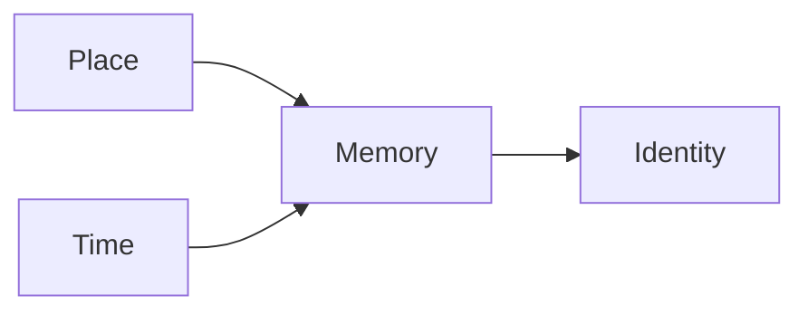

The relationship between memory and place shapes how the narrator understands the past.[^memory] Each return to a familiar setting reveals that recollection is an act of interpretation rather than a faithful record.

## Historical Context

The novel places private memory alongside public history. This structure makes even ordinary rooms and streets evidence of broader social change.[^memory]

> Places remember events differently than people do, but both kinds of memory change over time.

The pattern can be summarized as $M = P + T$, where memory depends on place and elapsed time.

$$
M(t) = \int_0^t P(x)\,dx
$$

| Setting | Narrative role |
| --- | --- |
| Childhood home | Personal memory |
| Town square | Shared history |

```text
memory -> interpretation -> identity
```



[^memory]: Memory here describes a reconstruction of the past rather than a permanent record.

<workscited>
- id: morrison-beloved
  type: book
  author:
    - family: Morrison
      given: Toni
  title: Beloved
  publisher: Vintage
  issued:
    date-parts:
      - [2004]
- id: goldman-transport
  type: article-journal
  author:
    - family: Goldman
      given: Anne
  title: Questions of Transport
  container-title: The Georgia Review
  volume: "64"
  issue: "1"
  page: 69-88
  issued:
    date-parts:
      - [2010]
  URL: https://www.jstor.org/stable/41403188
- id: mla-quick-guide
  type: webpage
  author:
    - literal: Modern Language Association
  title: "Works Cited: A Quick Guide"
  container-title: MLA Style Center
  URL: https://style.mla.org/works-cited-a-quick-guide/
  accessed:
    date-parts:
      - [2026, 9, 2]
</workscited>
